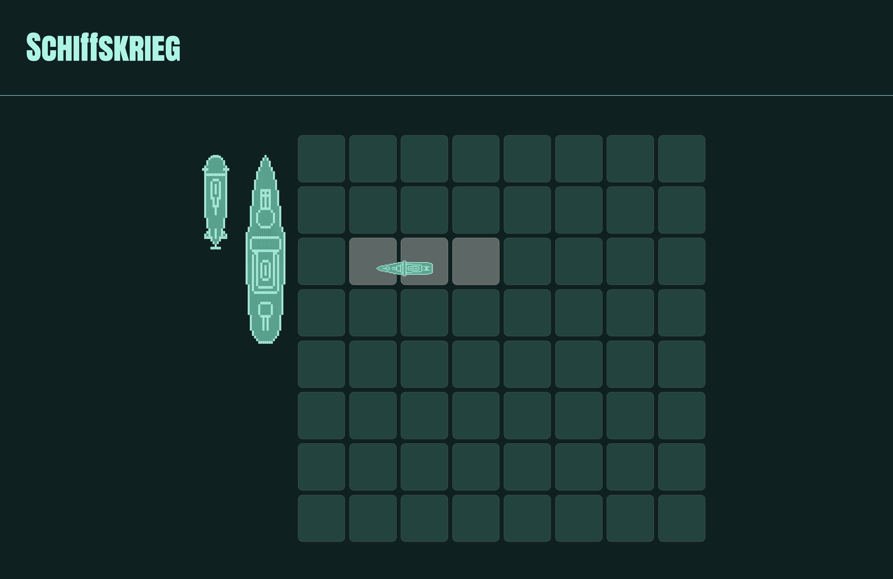

  

<h1 align="center">Schiffskrieg</h3>

<i>KAPEEWM them to the depths!</i>

  

 
 

## **ABOUT THE PROJECT**
### **Overview**
Become the ultimate naval warfare admiral with Schiffskrieg.

This is an online battle ship game
We enjoy board games and even more to play battle ship
User story:
    AS A battleship enthusiast
    I WANT to play the board game anywhere WITH my friends
    SO THAT I entertain and practice to distract myself

*Find the repo [here](https://github.com/Rod-Freedom/Schiffskrieg).* 
*Find the site [here](https://schiffskrieg.onrender.com)!*

 
 

## Table of Contents
- [License](#license)
- [Resources](#resources)
- [Get Started](#get-started)
- [Usage](#usage)
- [Demos](#demos)
- [Testing](#testing)
- [Contribute](#contribute)
- [Credits](#credits)

 

[(Back to the Top)](#about-the-project)

## Resources
* For Node:
    * `require()` as node modules.
    * `module.exports` for functions.
* `npm` packages:
    * Express for servers.
    * Express Handlebars for views.
    * Sequelize for DB's queries.
    * Jest for testing.
      * `describe()` and `it()` thoroughly applied for organized testing.
* Socket.io
    * `socket.emit()`.
    * `socket.on()`.
    * `socket.broadcast.emit()`.
* For JavaScript
    * Promises.
    * Object and array destructuring.
    * Polymorphism for methods.
    * Classes and constructors.
    * `throw new Error` to stop faulty executions.
    * `setTimeout` executions for UX.
    * `try` and 'catch`.
    * `async` and `await`.
    * `import from` as modules.
    * `"type": "module"` for exports.
    * `export default` for classes.

 

[(Back to the Top)](#about-the-project)

## Get Started
Make an account on the signup page to start a session.

 

[(Back to the Top)](#about-the-project)

## Usage
In the first page you just need to click on "Play", When the button with the username is clicked an stats section will be rendered.

 

[(Back to the Top)](#about-the-project)

## Demos
Place your ships!
> 

Attack your enemy!
>

Check your records!
>

 

[(Back to the Top)](#about-the-project)

## License
 
See the [license](https://github.com/Rod-Freedom/Schiffskrieg/blob/main/LICENSE) for more details.

 

[(Back to the Top)](#about-the-project)

## Contribute
If you have suggestions or want to help with some improvements, you can write me by [email](mailto:somemail@gmail.mx).

 

[(Back to the Top)](#about-the-project)

## Credits
All the code was created from scratch by [Rod's Freedom](https://github.com/Rod-Freedom), [David Miranda](https://github.com/dvdfml), and [Eynar](https://github.com/yordanop)
 

[(Back to the Top)](#about-the-project)
