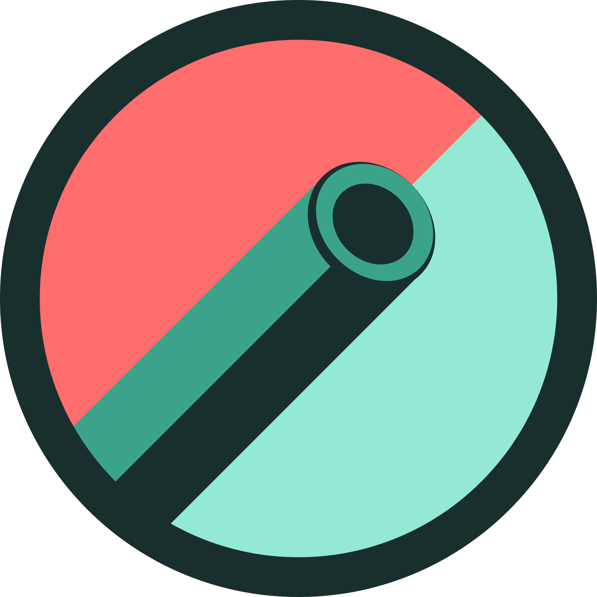

  

<h1 align="center">Schiffskrieg</h3>

<i>KAPEEWM them to the depths!</i>

  

 
 

## **ABOUT THE PROJECT**
### **Overview**
Become the ultimate naval warfare admiral with Schiffskrieg.

Write a description

*Find the repo [here](https://github.com/Rod-Freedom/Schiffskrieg).* 
*Find the site [here](url)!*

 
 

## Table of Contents
- [License](#license)
- [Resources](#resources)
- [Get Started](#get-started)
- [Usage](#usage)
- [Demos](#demos)
- [Testing](#testing)
- [Contribute](#contribute)
- [Credits](#credits)

 

[(Back to the Top)](#about-the-project)

## Resources
* For Node:
    * `fs` methods.
      * `fs.writeFile` to create the SVG.
      * `fs.existsSync` to look for folders.
      * `fs.mkdirSync` to create folders.
    * `import from` as modules.
    * `"type": "module"` for exports.
    * `export default` for classes.
    * `export` for functions.
    * `process.stdout` methods to manipulate the console.
* `npm` packages:
    * Inquirer for prompting.
    * Chalk for logs' format.
    * Chalk Animation to animate text in the terminal.
    * Nanospinner for waiting.
    * Jest for testing.
      * `describe()` and `it()` thoroughly applied for organized testing.
* For JavaScript
    * Promises.
    * Object and array destructuring.
    * Polymorphism for methods.
    * Classes and constructors.
    * `throw new Error` to stop faulty executions.
    * `setTimeout` executions for UX.

 

[(Back to the Top)](#about-the-project)

## Get Started
write get started

 

[(Back to the Top)](#about-the-project)

## Usage
write usage

 

[(Back to the Top)](#about-the-project)

## Demos

 

[(Back to the Top)](#about-the-project)

## License
 
See the [license](https://github.com/Rod-Freedom/Schiffskrieg/blob/main/LICENSE) for more details.

 

[(Back to the Top)](#about-the-project)

## Contribute
If you have suggestions or want to help with some improvements, you can write me by [email](mailto:somemail@gmail.mx).

 

[(Back to the Top)](#about-the-project)

## Credits
All the code was created from scratch by [Rod's Freedom](https://github.com/Rod-Freedom), Dave + GH url, and Yord + GH url...

 

[(Back to the Top)](#about-the-project)
